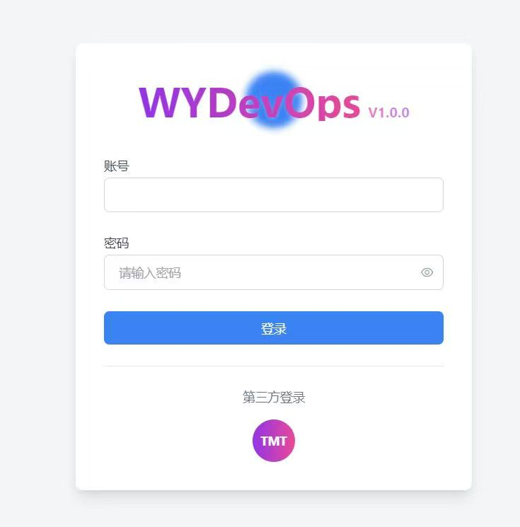

# Introduction to wydevops
This project uses a unified, standard process to manage the compilation, building, Docker image generation (multi-architecture), Chart image generation, offline release package creation, and automatic deployment of microservices.
The goal of wydevops is to create the most powerful, easily extensible and maintainable, and simplest to use CI/CD pipeline.

## Features of the Current V1.* Version
1. Designed to support multi-language projects (currently adapted for GO, JAVA, Next.js, Vue), single-module, and multi-module projects.
2. Supports building Docker images for both linux/amd64 and linux/arm64 architectures.
3. Supports two automatic deployment methods for microservices: K8S and Docker. In local working mode, the entire CI/CD process can be completed directly from the source code project, right up to the microservice running in Docker or a K8S cluster.
4. Supports layered packaging of microservice images, resulting in smaller deployment packages in production environments.
5. Includes a mechanism for sending notification messages to external systems.
6. Supports offline building of microservice deployment packages. It caches all third-party images pulled from the public network locally, providing great convenience for microservice development in private network environments.
7. Supports deploying multiple microservices with a single Chart, facilitating unified release and uninstallation of tightly coupled business modules.
8. Supports deploying multiple microservices within a single container, minimizing the use of valuable Pod resources.
9. Supports Nexus 3 and Harbor (2.10+) as Docker and Chart image repositories, eliminating the need for the helm push plugin.
10. Supports integration with Jenkins. A single entry script is all that's needed to integrate with a Jenkins Pipeline.
11. All code is developed in shell, providing maximum flexibility and user adaptability, with the lowest learning curve for developers of various languages.
12. Features a powerful, originally developed tool for reading and writing YAML files, offering great convenience for users to extend functionality.
13. Designed with a three-tier management model (company, development group, project), providing interfaces for personnel at all levels to manage and control the CI/CD process.
14. Provides a plugin mechanism for K8S resource configuration files, making it easy for developers to customize configurations.
15. Based on this project, the maintenance team has developed the wydevops microservice management platform, which is not yet open-sourced.

## Running Environment
1. Can run in the Git Bash command line on Windows.
2. Can run in the Bash command line on Linux.
3. Can be integrated with a Jenkins Pipeline via the Jenkinsfile provided in the source code.

## Third-Party Dependencies
1. jp
   This is a command-line tool for processing JSON files. Users need to download and install it themselves. It can be downloaded from [here](https://github.com/jmespath/jp).
   Ubuntu installation command: `apt install jq`
   Windows installation command: `choco install jq`
2. libxml2
   This is a library for processing XML files. Users need to download and install it themselves.
   Ubuntu installation command: `apt install libxml2-dev`
   Windows installation command: `choco install libxml2`
3. docker
   This is a tool for building and managing Docker images. Users need to download and install it themselves.
   Ubuntu installation command: `apt install docker-ce`
   On Windows, it can be downloaded and installed from here: [Docker Desktop](https://www.docker.com/get-started)
4. helm
   This is a tool for deploying microservices on K8S. This project will automatically install the corresponding helm command from the `/tools` directory based on the system architecture (the built-in version is v3.15.1), so users do not need to install it.
5. kubectl
   This is a command-line tool for managing K8S resources.
   On Linux, this project will automatically install the corresponding kubectl command from the `/tools` directory based on the system architecture, so users do not need to install it.
   On Windows, users can install Docker Desktop and start the built-in K8S cluster (convenient for local debugging), as Docker Desktop includes the kubectl command; alternatively, run the installation command: `choco install kubectl`.
   After installing kubectl, you need to specify the K8S cluster information it manages, as follows:
    1) In Windows Search, type "environment variables" and select "Edit the system environment variables".
    2) In the "System Properties" dialog, click the "Environment Variables..." button.
    3) In the "User variables" or "System variables" section, click "New...".
    4) For the variable name, enter `KUBECONFIG`.
    5) For the variable value, enter the full path to your kubeconfig file, for example, `C:\Users\YourUser\.kube\my-cluster-config`.
    6) Click OK to save. You will need to open a new terminal window for the changes to take effect.
6. istio
   Under the default configuration, wydevops deploys microservices using the Istio sidecar model.
   Therefore, it is required that Istio is already installed in the K8S cluster (see [here](https://istio.io/latest/docs/setup/getting-started/) for installation instructions).
   Additionally, wydevops will connect to the target cluster (specified by the `targetApiServer` parameter) to dynamically fetch the `apiVersion` for all generated K8S resource types,
   ensuring that the version of the generated K8S resources is consistent with the target cluster.

## Installation Steps
1. Clone the project's code to your local machine.
   `git clone -b master https://github.com/sichuanwuyi/wydevops.git`
   or
   `git clone -b master https://gitee.com/tmt_china/wydevops.git`
2. Define the environment variable `WYDEVOPS_HOME` to point to the root directory of the downloaded project.
   On Ubuntu, execute in order:
    1) `vim ~/.bashrc`
    2) At the end of the file, add: `export WYDEVOPS_HOME={path_to_downloaded_project_root}`, then save and exit.
    3) Execute the command: `source ~/.bashrc`
       On Windows:
    1) In Windows Search, type "environment variables" and select "Edit the system environment variables".
    2) In the "System Properties" dialog, click the "Environment Variables..." button.
    3) In the "User variables" or "System variables" section, click "New...".
    4) For the variable name, enter `WYDEVOPS_HOME`.
    5) For the variable value, enter the root directory of your downloaded project.
    6) Click OK to save. You will need to open a new terminal window for the changes to take effect.
3. Install third-party dependencies (see the previous section for installation methods).
4. Verify the installation.
   Execute the command: `bash $WYDEVOPS_HOME/script/wydevops.sh -h`
   If there are no errors, the installation was successful.

## Integration with Projects to be Packaged and Deployed
1. Copy the `$WYDEVOPS_HOME/script/wydevops-run.sh` file to the root directory of the target project.
2. Open the `wydevops-run.sh` file in the root directory of the target project and modify or confirm the following in the parameter line for executing `wydevops.sh` at the end of the file:
    1) Specify the local cache directory for third-party Docker images (`-I` parameter). The default value is `~/.wydevops/cachedImage`.
    2) Specify the project's language type (`-L` parameter). Currently supported values are: `java`, `go`, `nextjs`, `vue`. For other project types, you need to extend it yourself or contact the wydevops team.
    3) Confirm the architecture type for this build (`-A` parameter). Optional values are: `linux/amd64`, `linux/arm64`. The default is `linux/amd64`.
    4) Confirm the architecture type for the offline installation package generated by this process (`-O` parameter). Optional values are: `linux/amd64`, `linux/arm64`. The default is `linux/amd64`.
    5) Other parameters can remain unchanged. If you need to modify them, you can execute `bash $WYDEVOPS_HOME/script/wydevops.sh -h` for detailed parameter information.
3. Create a file named `ci-cd-config.yaml` in the root directory of the target project.
   In the `globalParams` configuration section of this file, the following parameters must be added:
    1) Service name (`serviceName`)
    2) Service version (`businessVersion`)
    3) Service's main port (`mainPort`), multi-port configuration is supported (port numbers separated by English commas).
    4) Service's gateway host (`gatewayHost`), default is `*`, meaning any host.
    5) Service's gateway path prefix (`gatewayPath`), default is `/"${serviceName}"`. This can be modified according to actual needs.
       By default, the gateway will strip `/"${serviceName}"` from the request path during forwarding (determined by rewrite rules).
    6) Whether to enable K8S service liveness probe (`livenessProbeEnable`), default is `true`.
    7) If `livenessProbeEnable=true`, the K8S service liveness probe URI (`livenessUri`) must be configured, default is `"/health"`.
    8) Whether to enable K8S service readiness probe (`readinessProbeEnable`), default is `true`.
    9) If `readinessProbeEnable=true`, the K8S service readiness probe URI (`readinessUri`) must be configured, default is `"/health"`.
    10) Default K8S cluster node server SSH parameter information (`targetApiServer`), format: `{server_ip}|{ssh_port}|{ssh_user}|{ssh_password}`.
        Passwordless SSH login from the local machine to the node server must be configured in advance, otherwise deployment will fail.
    11) Target namespace for deployment (`targetNamespace`), default is `default`. Non-existent namespaces will be created automatically during deployment.
        Example: `targetApiServer: 172.27.213.84|22|admin|admin123456`
    12) Repository information for pulling images within the K8s cluster (`targetDockerRepo`),
        Format: `{repo_type(nexus or harbor)},{instance_name(nexus) or project_name(harbor)},{repo_access_address({IP}:{port})},{login_account},{login_password}`
        Example: `targetDockerRepo: registry,wydevops,192.168.1.218:30783,admin,admin123,30784`

    The above parameters must be configured before executing the subsequent processes, otherwise deployment will fail. There are many other configuration parameters. For a more comprehensive understanding,
    please refer to the configuration template files `_ci-cd-template.yaml` for each language in the `$WYDEVOPS_HOME/script/templates/config` directory. This file contains details of all configuration parameters.

## Deep Customization for Specific Project Types
For Java and Go projects, wydevops has done further deep customization. Through `params-mapping-in-yaml-file.config` and `params-mapping-in-xml-file.config` files,
parameters 1)-5) above are bound to certain parameters in the target project's own configuration files (refer to the comments in the `params-mapping-in-*-file.config` files for specific binding rules).
When wydevops runs, it will automatically extract the values of the bound parameters based on the target project's configuration files. This type of `params-mapping-in-*-file.config` file depends on the project development specifications within each company or organization,
and is the concrete embodiment of the R&D team's project specifications in wydevops. This binding mechanism can enforce strict adherence to development specifications by developers.
In actual development, the content of the `params-mapping-in-*-file.config` files can be flexibly adjusted to adapt to the R&D team's project development specifications.
1. Default Java Project Specification
    1) In the Java specification supported by wydevops by default, all `application.yaml` files must be stored in the `/resources/config` directory.
    2) By default, wydevops uses `application-prod.yaml` as the configuration file for the production environment, meaning `spring.profiles.active` must be set to `prod` when packaging for production.
    3) The `params-mapping-in-yaml-file.config` file details which parameters in `application*.yaml` files are bound to which wydevops parameters.
    4) The `params-mapping-in-xml-file.config` file details which custom parameters are in the `pom.xml` file and which wydevops parameters their values are bound to.
2. Default Go Project Specification
    1) The default configuration file name for the production environment is `config-prod.yaml`, and this file must be located in the project's root directory.
    2) The `config-prod.yaml` file must contain:
    3) `app.gateway.domain`—its value is bound to `globalParams.gatewayHost`.
    4) `app.gateway.route-prefix`—its value is bound to `globalParams.gatewayPath`.
    5) `app.port`—its value is bound to `globalParams.mainPort`, `globalParams.containerPorts`, and `globalParams.servicePorts`.
    6) `app.version`—its value is bound to `globalParams.businessVersion`.

## Sample Project Descriptions
The `/sample` directory in the project source code contains sample projects for four types: Java, Go, Next.js, and Vue. Each example is relatively simple, and interested developers can refer to these sample projects.

## wydevops Microservice Management Platform (V1.0.0)
Based on the offline installation packages for microservices packaged by wydevops, the team has developed a microservice management platform for managing microservice deployment, monitoring, logging, etc.
This platform is not yet open-sourced and will be improved and optimized within the team. The main core interfaces are shown below:
1. Login Interface
2. Cluster Overview Interface
3. Cluster Node Interface 
4. Application List Interface
5. Service List Interface
6. User Management Interface 
7. Offline Installation Package Slice Upload Interface
8. Post-Upload Decompression and Verification Interface
9. Application Installation Process Interface 
10. Dynamic Configuration Parameter Modification Interface 
11. Istio-based Canary Release Interface 
12. Application Log Viewing Interface
13. Container Command Line Interface