# Introduction to wydevops

This project uses a unified, standard process to manage the compilation, building, Docker image generation (multi-architecture), Helm chart generation, offline release package creation, and automated deployment of microservices.
The goal of wydevops is to create the most powerful, easily extensible and maintainable, and simplest-to-use CI/CD pipeline.

## Features of the Current V1.* Version

1. Designed to support multi-language projects (currently adapted for Go, Java, Next.js, and Vue), as well as single-module and multi-module projects.
2. Supports building Docker images for both `linux/amd64` and `linux/arm64` architectures.
3. Supports two automated microservice deployment methods: K8S and Docker. In local working mode, the entire CI/CD process can be completed directly from the source code project, right up to the microservice running in Docker or a K8S cluster.
4. Supports layered packaging of microservice images, resulting in smaller deployment packages for production environments.
5. Includes a mechanism for sending notification messages to external systems.
6. Supports offline building of microservice deployment packages, caching all third-party images pulled from the public network locally, which greatly facilitates microservice development in private network environments.
7. Supports deploying multiple microservices with a single Helm chart, making it easy to uniformly release and uninstall closely coupled business modules.
8. Supports deploying multiple microservices within a single container, minimizing the use of valuable Pod resources.
9. Supports nexus3、harbor(2.10+)、registry、aws-ecr(AWS ECR repository) as Docker and Helm chart repositories, eliminating the need for the `helm-push` plugin.
10. Supports registry as Docker repositories.
11. Supports integration with Jenkins, allowing consolidation with Jenkins Pipelines using just a single entry script.
12. All code is developed in Shell, providing maximum flexibility and user adaptability, with the lowest learning curve for developers of various languages.
13. The project includes powerful, originally developed tools for reading and writing YAML files, offering great convenience for users to custom-extend functionalities.
14. Designed with a three-tier management model (company-level, development group-level, project-level), providing interfaces for personnel at all levels to manage and control the CI/CD process.
15. Provides a plugin mechanism for K8S resource configuration files, making it easy for developers to customize configurations.
16. Based on this project, the maintenance team has already developed the wydevops microservice management platform, which is not yet open-sourced.

## Running Environment

1.  Can be run in the Git Bash command line on Windows.
2.  Can be run in the Bash command line on Linux.
3.  Can be integrated with Jenkins Pipelines via the `Jenkinsfile` provided in the source code.

## Third-Party Dependencies

1.  **git**
    *   On Ubuntu (Debian/Ubuntu series):
        Update package index and install:
        ```
        sudo apt update
        sudo apt install -y git
        ```
        Verify: `git --version`
        Basic configuration: `git config --global user.name "Your Name"` and `git config --global user.email "you@example.com"`
    *   On Windows using the official installer:
        Download and run: https://git-scm.com/download/win
        Follow the installation wizard (default options are fine).
        Open PowerShell or cmd, and verify: `git --version`
        Basic configuration (in PowerShell or Git Bash): `git config --global user.name "Your Name"` and `git config --global user.email "you@example.com"`

2.  **libxml2**
    This is a library for processing XML files. Users need to download and install it themselves.
    Currently, it is only used in Java projects to read configurations from the pom.xml file. Installation is not required for non-Java projects.
    *   Ubuntu (Debian/Ubuntu series) installation command: `sudo apt install libxml2-utils`
    *   Windows installation command: `choco install libxml2`

3.  **docker**
    This is a tool for building and managing Docker images. Users need to download and install it themselves.
    *   Ubuntu (Debian/Ubuntu series) installation command: `sudo apt install docker-ce`
    *   For Windows, it can be downloaded and installed from here: [Docker Desktop](https://www.docker.com/get-started)

4.  **helm**
    This is a tool for K8S microservice deployment. This project will automatically install the corresponding `helm` command (the built-in version is v3.15.1) from the `/tools` directory based on the system architecture, so users do not need to install it.

5.  **kubectl**
    This is a command-line tool for K8S resource management.
    *   On Linux, this project will automatically install the corresponding `kubectl` command from the `/tools` directory based on the system architecture, so users do not need to install it.
    *   On Windows, users can install Docker Desktop and start its built-in K8S cluster (convenient for local debugging), as Docker Desktop comes with the `kubectl` command; alternatively, run the installation command: `choco install kubectl`.
    *   After installing `kubectl`, you need to specify the K8S cluster information it manages, as follows:
        1)  Type "Environment Variables" in the Windows search and select "Edit the system environment variables".
        2)  In the "System Properties" dialog, click the "Environment Variables..." button.
        3)  In the "User variables" or "System variables" section, click "New...".
        4)  For `Variable name`, enter `KUBECONFIG`.
        5)  For `Variable value`, enter the full path to your kubeconfig file, e.g., `C:\Users\YourUser\.kube\my-cluster-config`.
        6)  Click OK to save. You will need to open a new terminal window for the settings to take effect.

6.  **Istio must be installed in the K8S cluster**
    Under the default configuration, wydevops deploys microservices using the Istio sidecar model.
    Therefore, it is required that Istio is already installed in the K8S cluster (see [here](https://istio.io/latest/docs/setup/getting-started/) for installation instructions).
    **Special Reminder:** wydevops will connect to the target cluster (specified by the `targetApiServer` parameter) to dynamically fetch the `apiVersion` for all generated K8S resource types, ensuring that the version of the generated K8S resources is consistent with the target cluster.

7.  **Dependencies for Local Compilation**
    This project supports the deployment of microservices for various target languages, each requiring its own specific build dependencies.
    For example, Java projects require a JDK, while Python projects need a Python interpreter.
    Please install the appropriate build dependencies based on your target language.
    Note: If you are building inside a Docker container, you do not need to install these local build dependencies.

## Installation Steps

1. Create a directory to serve as the root for wydevops, and define the environment variable `WYDEVOPS_HOME` to point to this directory.
    *   On Ubuntu (Debian/Ubuntu series):
        1) `vim ~/.bashrc`
        2) At the end of the file, add: `export WYDEVOPS_HOME={path_to_the_new_directory}`, then save and exit.
        3) Execute the command: `source ~/.bashrc`
    *   On Windows:
        1) Type "Environment Variables" in the Windows search and select "Edit the system environment variables".
        2) In the "System Properties" dialog, click the "Environment Variables..." button.
        3) In the "User variables" or "System variables" section, click "New...".
        4) For `Variable name`, enter `WYDEVOPS_HOME`.
        5) For `Variable value`, enter the path to the newly created directory.
        6) Click OK to save. You will need to open a new terminal window for the settings to take effect.
2. Open a Git Bash command line in the `$WYDEVOPS_HOME` directory and execute the following command to download the project's source code.
    `git clone -b master https://github.com/sichuanwuyi/wydevops.git`
    or
    `git clone -b master https://gitee.com/tmt_china/wydevops.git`
3. Create the `$WYDEVOPS_HOME/client-config.json` file and write the following content into it, so that wydevops can automatically update to the latest version upon execution.
    ```json
    {
      "repoUrl": "https://gitee.com/tmt_china/wydevops.git",
      "branch": "master"
    }
    ```
4. Define the environment variable WYDEVOPS_LOG_LANGUAGE (refer to item 1 for definition methods). 
   This is used to specify the language for the logs output by wydevops during runtime. Supported languages are: English (en-US) and Simplified Chinese (zh-CN). The default value is en-US. 
5. Define the environment variable WYDEVOPS_WORK_MODE (refer to item 1 for definition methods).
   This is used to specify the working mode for wydevops during runtime. Supported modes are: local mode and jenkins mode. The default value is local.
6. Install the third-party dependencies (see the methods described above).
7. Verify the installation.
    Execute the command: `bash $WYDEVOPS_HOME/wydevops/script/wydevops.sh -h`
    If there are no errors, the installation was successful.

## Integration with Projects to be Packaged and Deployed

1.  Copy the `$WYDEVOPS_HOME/wydevops/script/wydevops-run.sh` file to the root directory of the target project.
2.  Open the `wydevops-run.sh` file in the target project's root directory and modify or confirm the following in the parameter line of the `wydevops.sh` execution command at the end of the file:
    1)  Specify the local cache directory for third-party Docker images (the `-I` parameter). The default value is `~/.wydevops/cachedImage`.
    2)  Specify the project's language type (the `-L` parameter). Currently supported values are: `java`, `go`, `nextjs`, `vue`. For other project types, you need to extend it yourself or contact the wydevops maintenance team.
    3)  Confirm the architecture type for this packaging run (the `-A` parameter). Optional values are: `linux/amd64`, `linux/arm64`. The default is `linux/amd64`.
    4)  Confirm the architecture type for the offline installation package generated by this process (the `-O` parameter). Optional values are: `linux/amd64`, `linux/arm64`. The default is `linux/amd64`.
    5)  Other parameters can be left unchanged. If you need to modify them, you can execute the command `bash $WYDEVOPS_HOME/wydevops/script/wydevops.sh -h` to query parameter details.
3.  Create a file named `ci-cd-config.yaml` in the root directory of the target project.
    The following parameters must be added under the `globalParams` configuration section in this file:
    1)  The name of the microservice (`serviceName`).
    2)  The version of the microservice (`businessVersion`).
    3)  The main port number of the microservice (`mainPort`), multi-port configuration is supported (separate port numbers with an English comma).
    4)  The gateway domain for the microservice (`gatewayHost`), default is `*`, meaning any host.
    5)  The gateway path prefix for the microservice (`gatewayPath`), default is `/"${serviceName}"`. This parameter can be modified according to actual needs. By default, the gateway will discard `/"${serviceName}"` from the request path during forwarding (determined by rewrite rules).
    6)  Whether to enable the K8S service liveness probe (`livenessProbeEnable`), default is `true`.
    7)  If `livenessProbeEnable=true`, the URI for the K8S service liveness probe (`livenessUri`) must be configured, default is `"/health"`.
    8)  Whether to enable the K8S service readiness probe (`readinessProbeEnable`), default is `true`.
    9)  If `readinessProbeEnable=true`, the URI for the K8S service readiness probe (`readinessUri`) must be configured, default is `"/health"`.
    10) Default SSH parameter information for the K8S cluster node server (`targetApiServer`), format: `{server_ip}|{ssh_port}|{ssh_user}|{ssh_password}`.
        Passwordless SSH login from the local machine to this node server must be configured in advance, otherwise deployment will fail.
    11) The target namespace for deployment (`targetNamespace`), default is `default`. Non-existent namespaces will be created automatically during deployment.
        Example: `targetApiServer: 172.27.213.84|22|admin|admin123456`
    12) Repository information for pulling images within the K8s cluster (`targetDockerRepo`),
        Format: `{repo_type(nexus or harbor)},{instance_name(nexus) or project_name(harbor)},{repo_access_address({IP}:{port})},{login_user},{login_password}`
        Example: `targetDockerRepo: registry,wydevops,192.168.1.218:30783,admin,admin123,30784`

    The above parameters must be configured before executing subsequent processes, otherwise deployment will fail. There are many other configuration parameters. For a more comprehensive understanding, please refer to the `_ci-cd-template.yaml` configuration template files for each language in the `$WYDEVOPS_HOME/wydevops/script/templates/config` directory. This file contains details of all configuration parameters.

## Deep Customization for Specific Project Types

For Java and Go projects, wydevops has undergone further deep customization. Through `params-mapping-in-yaml-file.config` and `params-mapping-in-xml-file.config` files, parameters 1)-5) mentioned above are bound to certain parameters in the target project's own configuration files (for specific binding rules, please refer to the comments in the `params-mapping-in-*-file.config` files).
When wydevops runs, it automatically extracts the values of the bound parameters based on the target project's configuration files. These `params-mapping-in-*-file.config` files depend on the internal project development specifications of each company or organization and are the concrete embodiment of the R&D team's project specifications within wydevops. This binding mechanism can enforce strict adherence to development specifications by developers.
In actual development, the content of the `params-mapping-in-*-file.config` files can be flexibly adjusted to adapt to the R&D team's project development specifications.

1.  **Default Specification for Java Projects**
    1)  In the Java specification supported by wydevops by default, all `application.yaml` files must be stored in the `/resources/config` directory.
    2)  By default, wydevops uses `application-prod.yaml` as the production environment configuration file for Java projects, meaning `spring.profiles.active` must be configured as `prod` when packaging for the production environment.
    3)  The `params-mapping-in-yaml-file.config` file details which parameters in `application*.yaml` files are bound to which wydevops parameters.
    4)  The `params-mapping-in-xml-file.config` file details which custom parameters the `pom.xml` file has and which wydevops parameters their values are bound to.
2.  **Default Specification for Go Projects**
    1)  By default, the configuration file name for the production environment is `config-prod.yaml`, and this file must be located in the project's root directory.
    2)  The `config-prod.yaml` file must contain:
    3)  `app.appName` — its value is bound to `globalParams.serviceName` and `globalParams.serviceNameZh`.
    4)  `app.version` — its value is bound to `globalParams.businessVersion`.
    5)  `app.port` — its value is bound to `globalParams.mainPort`, `globalParams.containerPorts`, and `globalParams.servicePorts`.
    6)  `app.gateway.domain` — its value is bound to `globalParams.gatewayHost`.
    7)  `app.gateway.route-prefix` — its value is bound to `globalParams.gatewayPath`.

**Important Note: Wydevops parameters that have binding rules defined in the `params-mapping-in-*-file.config` files do not need to be specified in `ci-cd-config.yaml`.**

## Sample Project Description

The `/sample` directory in the project source code contains sample projects for four types: Java, Go, Next.js, and Vue. Each example is relatively simple, and interested developers can refer to these sample projects.

## 💼 Commercial Support & Services

For organizations that require professional assistance, I offer a range of paid services to help you get the most out of `wydevops`. Whether you're looking to integrate it into a complex environment, need custom features, or require dedicated support, I'm here to help.

My services include:

1. **Consulting & Implementation**: Expert guidance on integrating `wydevops` into your existing CI/CD pipelines and development workflows.
2. **Custom Feature Development**: Need a specific feature or integration? I can design, build, and test custom extensions tailored to your unique requirements.
3. **Premium Support**: Get dedicated, priority support with guaranteed response times (SLA) for your mission-critical systems.

If you or your team are interested in leveraging my expertise to accelerate your DevOps journey, please feel free to reach out.

**Contact**: `11372349@qq.com`

## wydevops Microservice Management Platform (V1.0.0)

Based on the offline installation packages for microservices packaged by wydevops, the team has developed a microservice management platform for managing microservice deployment, monitoring, logging, etc.
This platform is not yet open-sourced and will be further improved and optimized within the team. The main core interfaces are shown below:

1.  Login Interface 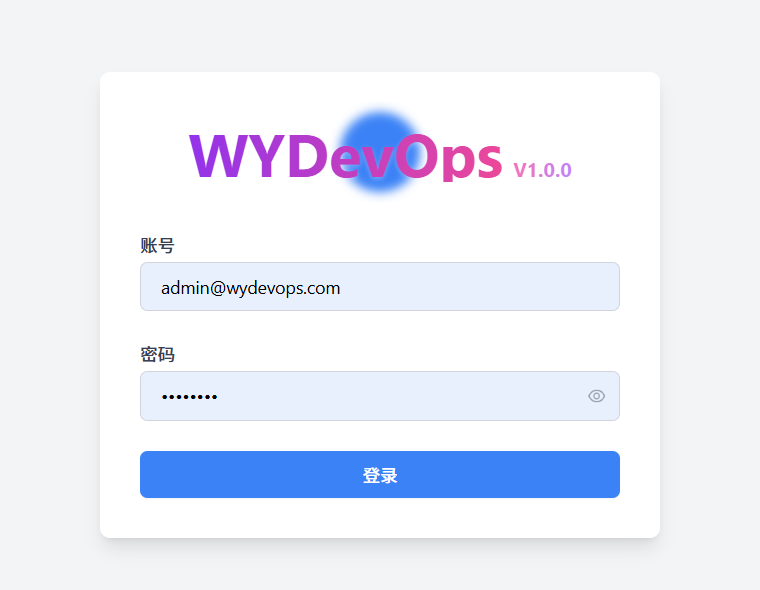
2.  Cluster Overview Interface 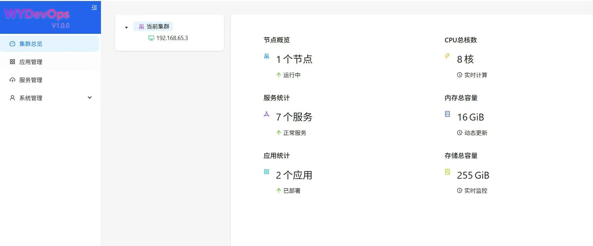
3.  Cluster Node Interface 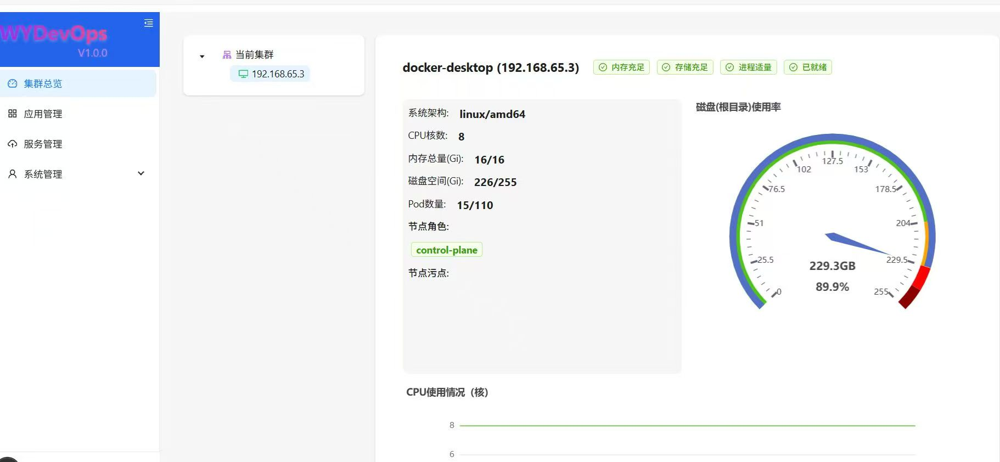 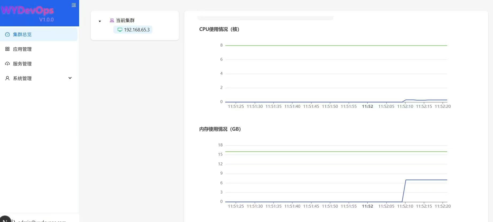
4.  Application List Interface 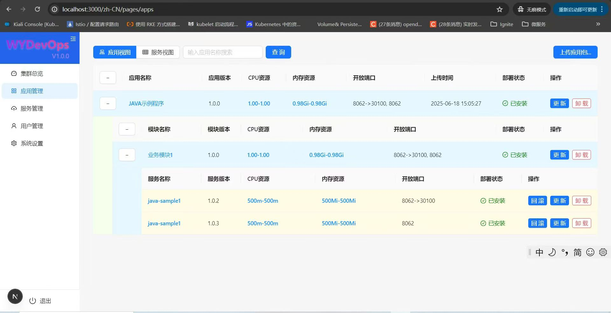
5.  Service List Interface 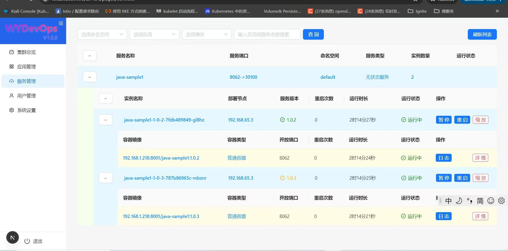
6.  User Management Interface 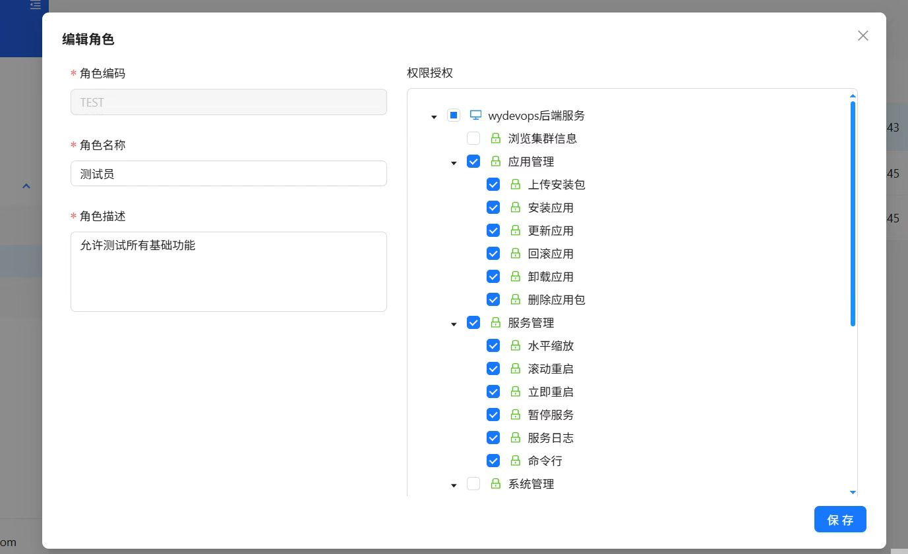 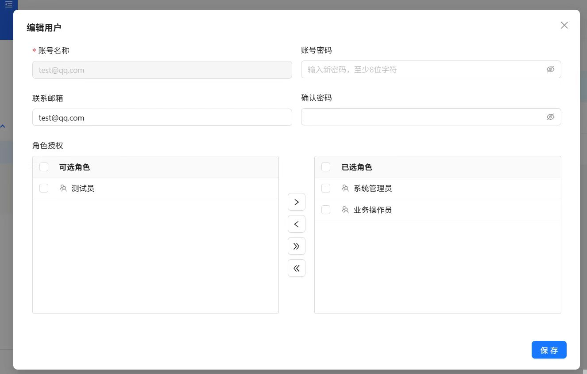
7.  Offline Package Slice Upload Interface 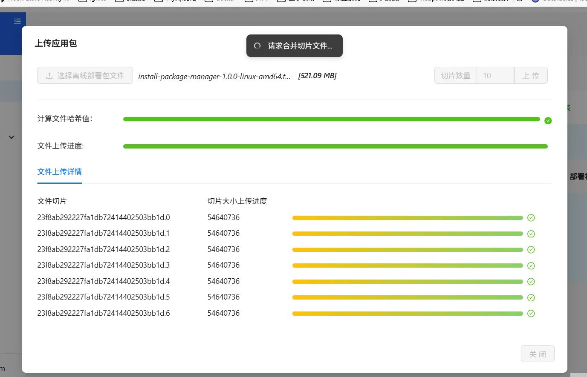
8.  Post-Upload Decompression and Verification Interface 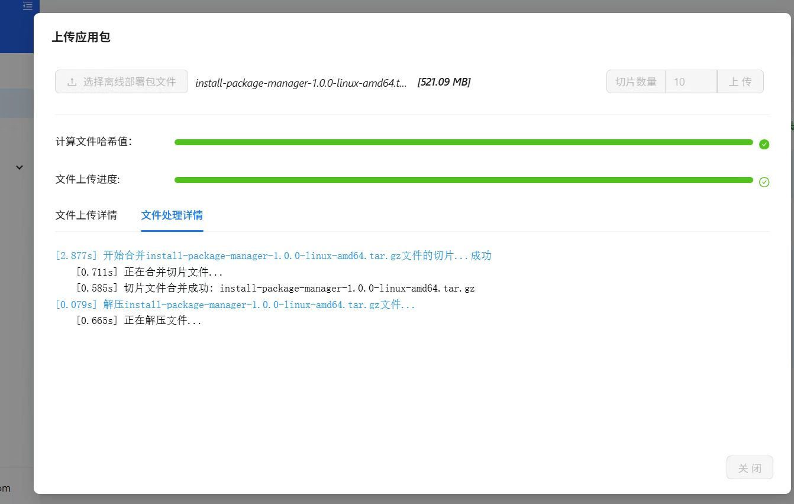
9.  Application Installation Process Interface 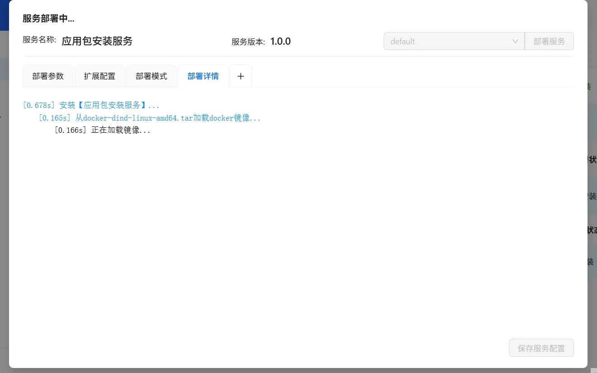 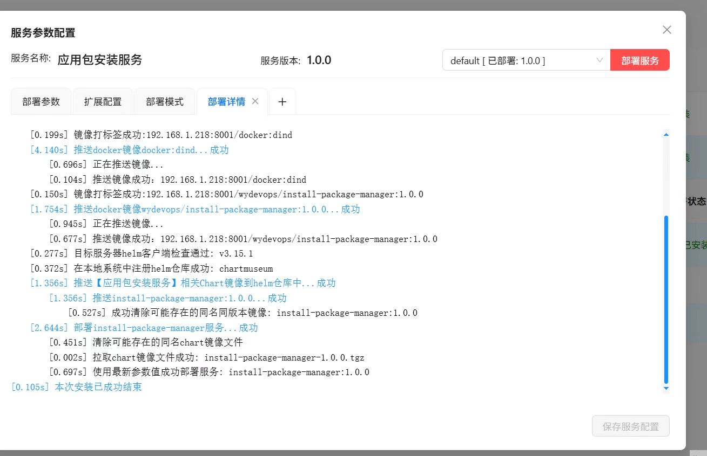
10. Dynamic Configuration Parameter Modification Interface 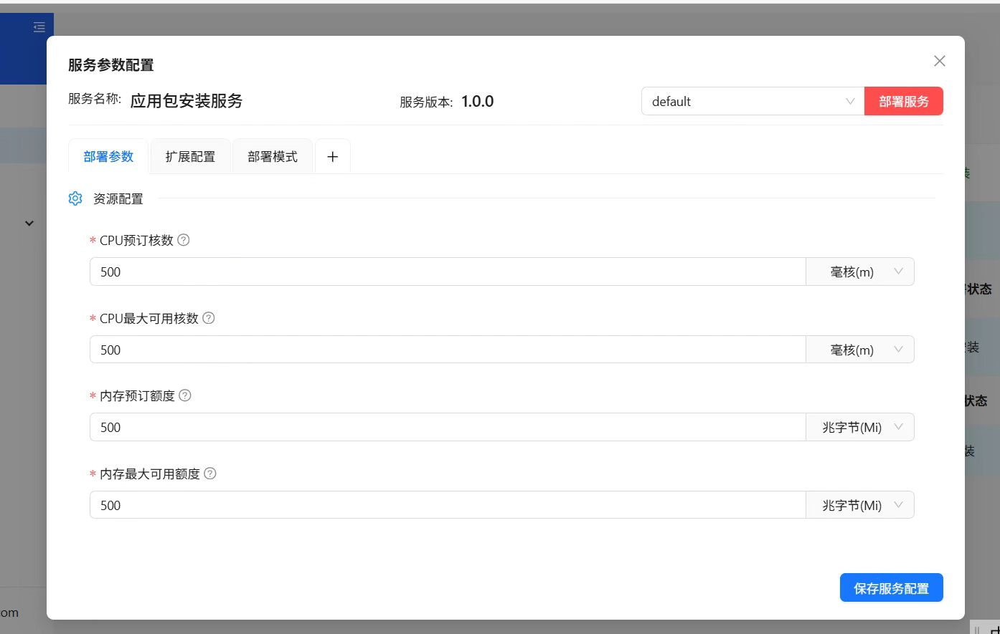 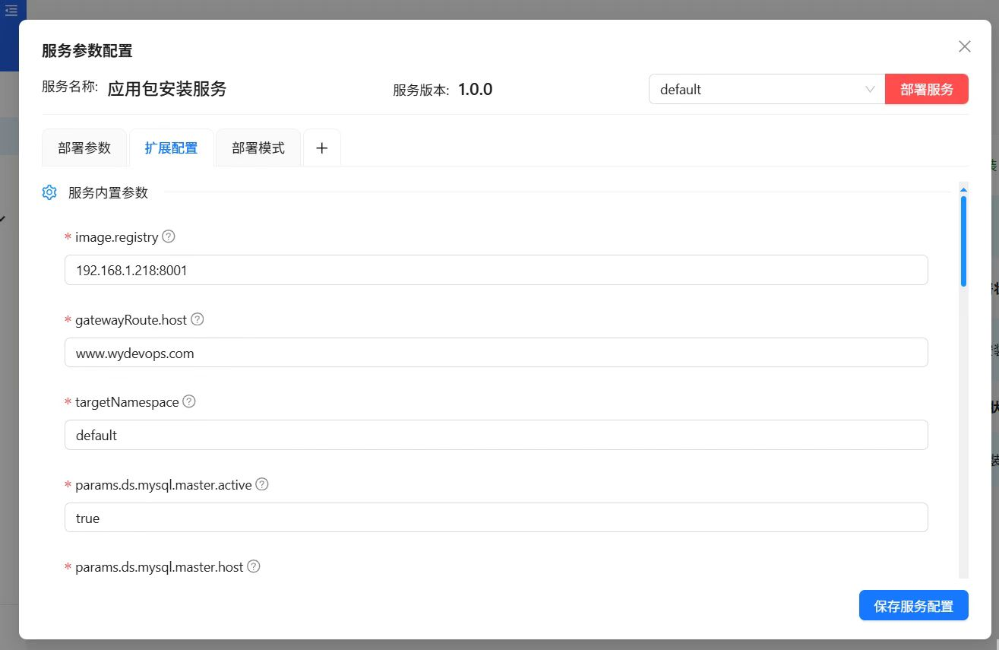
11. Istio-based Canary Release Interface 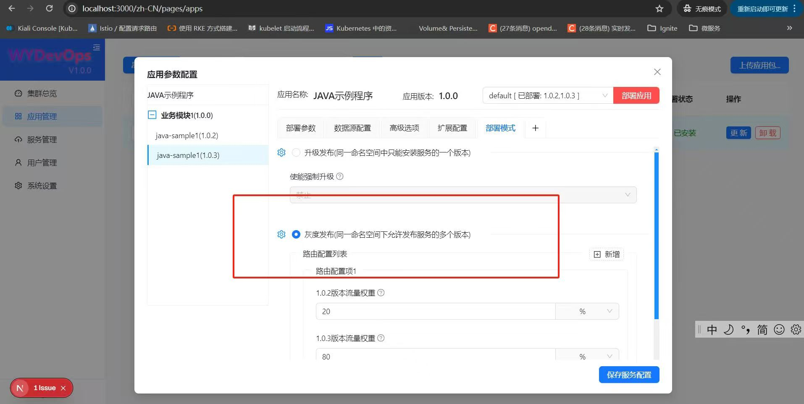 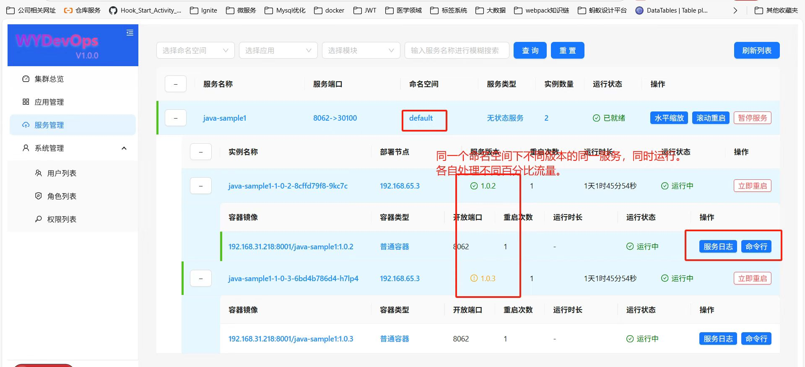
12. Application Log Viewing Interface 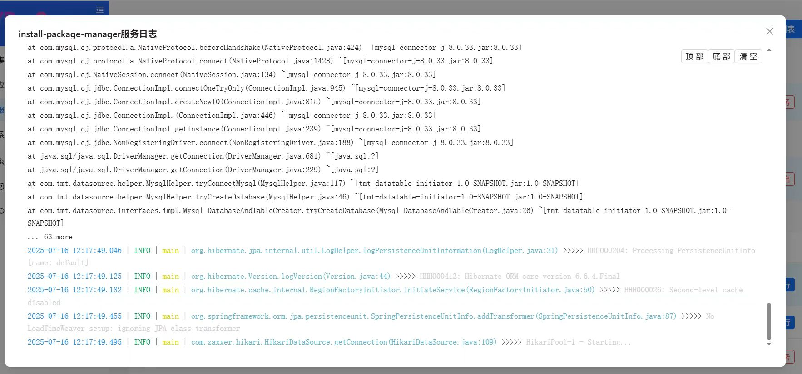
13. Container Command Line Interface 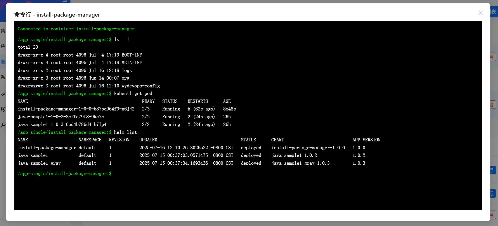